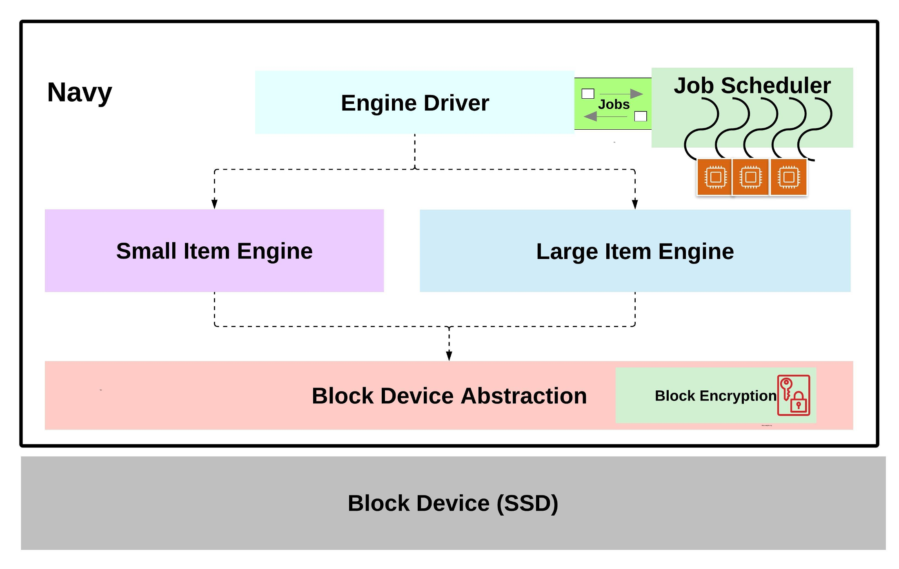
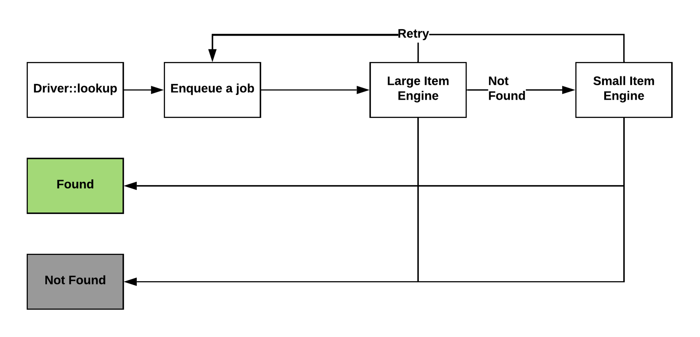

Navy is the SSD optimized cache engine leveraged for Hybrid Cache. There are three over-arching goals in the design  of Navy
1. efficient caching for billions of  small (<1KB) and millions of large objects (1KB - 16MB)  on SSDs.
2. read optimized point lookups
3. Low DRAM overhead

Since Navy is designed for a cache, it chooses to sacrifice the durability of data when it enables the accomplishment  of the goals above. Caches are effective by constantly churning through the items based on popularity, making them write intensive.  Since write-endurance is a constraint for NVM, the design of Navy optimizes for write-endurance as well.

## Implementation overview

Navy's implementation is broken down into the following hierarchy.

Navy offers an asynchronous API to it's callers.  Navy optimizes for small objects using the Small Item Engine and optimizes for large objects using the Large Item Engine.  Each engine is designed taking into account the DRAM overhead required without compromising read efficiency. Underneath, both the engines operate on top of a block device abstraction.

###  Device

All IO operations within Navy happen over a range of block offsets. `Device` provides a virtual interface for reads and writes into these offsets. Underneath, the Device could be either a `FileDevice` implementation over single file on a file system or a raw block device file or a `RAID0Device` that operates a software raid-0 over  many files or an `InMemoryDevice` using a malloced buffer (for testing).  `Device` aligns all reads  from its calles to `ioalignSize` that is used to configured the `Device` and trims any extra data that is read.  `Device` also handles opaque functionality like encryption, chunking, latency measurements for reading and writing while delegating the actual reads or writes to underlying implementation.

**Encryption**: `Device` can be initialized with a `DeviceEncrytor` to support block level encryption. All reads and writes pass through the encryption layer and is done at the granularity of encryption block size.  The IO alignment for reads and writes must match the block size used for encryption.

**Chunking**:  Large writes (MBs) can cause head of line blocking for reads on SSDs. To avoid the negative impact on the tail latency for reads, `Device` can be configured to break up writes into chunks and issue them sequentially. While this can increase the latency for writes, read latency can be improved.  Reads are not broken into chunks. Note, this chunking is orthogonal to the RAID-0 chunking that happens with `RAID0Device`. Usually the block size for encryption is as small as 4KB and the stripe size for `RAID0Device` is set to the size of a Navy region(16-64MB).

**LatencyTracking**: Device also tracks the overall latency for reads and writes in a uniform way across all implementations of Device.

### Engine Driver

Items can be cached in either the small or the large item engine depending on their size. While, size is known during insert, lookups and deletes dont, and hence must check both engines before concluding.  Besides this, there are no high level locks per key to synchronize concurrent operations across both the engines. Hence the `Driver` assumes the responsibility of request processing across the two engines. It accepts Navy API request that are asynchronous in nature and  leverages the `JobScheduler` to execute them through a state machine below.

For example, when a lookup job is enqueued, driver performs the lookup in the Large Item engine first and upon a miss, enqueues another job to perform the lookup to the small item engine. When either results in a final result, the loookup callback is executed inline.

The driver is also responsible for doing admission policy that are internal to Navy. Currently, Navy implements the following admission policy mechanisms that can be enabled.
1. `RejectRandomAP`: Writes are probabilistically rejected based on a configured probabilty.
1. `DynamicRandomAP`: Tracks the bytes written at device level and ensures the daily budget is under a specified write rate. This is done by doing probabilistic rejection where the rejection probability is updated every X seconds based on the bytes written so far and the budget available into the future.  To support this, the bytes written from `Device` is plumbed into the admission policy.
2. `RejectFirstAP`: writes to key is rejected upon the first occurence within a configured window. Subsequent write is accepted.
3. MaxConcurrentInserts: writes are rejected once sufficient number of them have been queued up.
4. MaxParcelMemory: Each insert job has a memory footprint associated. Writes are rejected once sufficient number have been queued up exceeding a certain configured memory footprint.

### Job Scheduler

`Driver` enqueues an API Request as a `Job` to the `JobScheduler` in the order it was received. Inside the `JobScheduler`,  jobs are ordered to avoid concurrent execution of multiple jobs for the same key. This is important given the async nature of the navy API. With this guarantee, callers can make assumptions about the concurrency of operations once enqueued to navy. This is relevant to using  optimistic concurrency by `NvmCache` implementation.

To order the jobs, `JobScheduler` shards the jobs based on its key into one of several fine grained shards (millions). There can be only one job executed for a given request ordering shard at any given time, and if there is already one being executed, the  rest are queued up in a pending job queue. Once the ordering condition is met, Jobs are sharded to be enqueued into one of several `JobQueue`.  Jobs can be one of the following types; `JobType::Read` for jobs corresponding to read apis for Navy (lookups), `JobType::Write` for jobs corresponding to write apis for Navy (inserts and deletes), `JobType::Reclaim` to perform internal eviction operations and `JobType::Flush` to perform any internal async bufferred writes.

The `JobScheduler` has two executor thread pools (read and write) and Jobs are sharded by key to the appropriate thread pools.  Each  thread in the pool has a corresponding `JobQueue` and a  dedicated thread associate with processing its  jobs.  Jobs  are processed in FIFO manner, but some Jobs can be enqueued directly to the front of the queue to prioritize over others.  Except `JobType::Read` all other jobs are executed by the writer pool. While enqueuing, `JobType::Reclaim` and `Jobtype::Flush` are given higher priority enqueuing them to the head of the queue. These operations are key agnostic and are internal to Navy and hence can be executed out of order from other read and write operations. Jobs can also be retried based on their exit status returned from the implementation. For example, when performing a lookup, the driver can retry a job to lookup in the small item engine after a lookup in the large item engine returns not found. Jobs are always enqueued to the back of their queue for retry.

