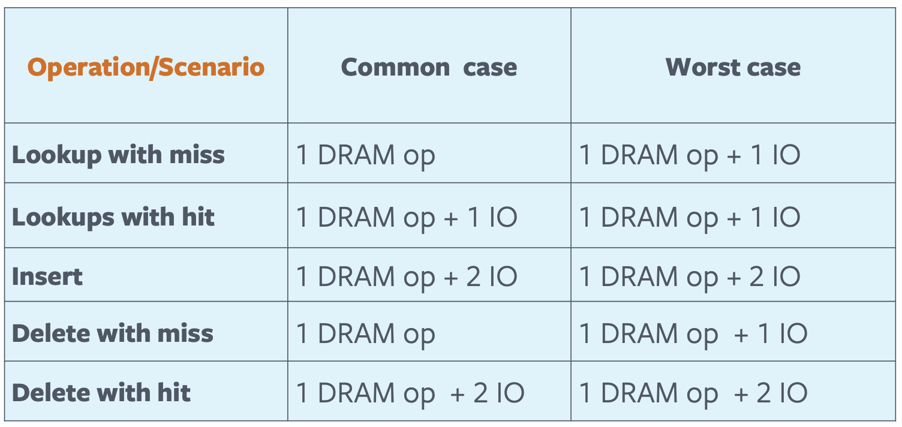

The Small Object Cache (SOC)   caches objects that are 100s of bytes in size using 100s of GB of SSD. SOC is implemented as a set associative cache to reduce the DRAM overhead for indexing.  SOC is initialized with large range of blocks specified through a start offset and size.

 ## Buckets
SOC divides the available range of block space into fixed size buckets. The size of the `Bucket` is typically the smallest unit of read into the SSD(4KB), but is configurable. A`Bucket` has a  header followed by sequence of key value pairs.  The header encapsulates the following:
* a checksum that is used for validating the content of bucket against IO errors.
* generation timestamp that is used to determine if the bucket is properly intialized.
* capacity, number of keys and offset of next allocation to manage the storage portion.

The header in total consumes 24 bytes per bucket. Following the header bits is sequence of key, value pairs corresponding to `BucketEntry`.  `BucketEntry` contains a key size,  value size and hash for quick search, followed by actual key and value. The overhead for `BucketEntry` is 20 bytes per entry.

Buckets are always read entirely and written entirely. SOC uses an array of `folly::SharedMutex` to protect concurrent reads and writes to the corresponding bucket associatively.

## Lookups

Keys are associatively hashed into the buckets based on a uniform hash function.
Since hybrid caches are usually leveraged in deployments that have 50-80% hit ratio, a significant volume of lookups could be for keys that don't exist. To speed up the performance of lookups, SOC can be configured to use a `BloomFilter`. The  `BloomFilter` is utilized to quickly answer if a key might be missing from the cache.  To perform a lookup, SOC computes the hash of the key to locate the `Bucket` corresponding to it. It then checks the corresponding `BloomFilter` to quickly determine if the key could exist. If positive, only then SOC performs the IO operation to read the `Bucket` into memory. Once read, the key value pairs are iterated quickly to locate the key being looked up. Due to the nature of the `BloomFilter`, SOC can have false positives. By controlling the bits per bucket, the false positive rate can be kept low (<7% with 16 bytes per 4KB bucket). SOC can efficiently cache billions of keys and perform lookups with single IO while consuming only 1-2GB of DRAM. To keep the DRAM overhead low, SOC does not adopt eviction policies like LRU that need additional DRAM overhead or additional writes into SSD to maintain ordering information. SOC employs a simple FIFO eviction policy.

## Inserts
To insert a cache into SOC, the key hash is used to determine the bucket. The `Bucket` is read into memory and if the key already exists and needs to be overridden, it is first removed and the `Bucket` is compacted in-memory. Next, SOC determines if there is sufficient space left in the `Bucket` to insert the new value for the key. Most often, caches operate being at full capacity. Hence, the `Bucket` would be full and SOC now has to pick a victim. To pick a victim, SOC employs a FIFO eviction policy. Keys are iterated in FIFO order and removed until there is enough space to insert the new key. SOC issues the removeCB for all evicted keys. Next, SOC writes the new state of the `Bucket` into SSD and reinitializes the `BloomFilter` to reflect the current content of the `Bucket`. The `BloomFilter` for any given bucket is updated upon every insert or delete operation that changes  the  contents of the `Bucket`.

## Deletes

Deletes are similar to insertion of keys when the key is present in SOC. SOC can quickly confirm if the key can be present. If so, SOC reads the `Bucket`, scans through the keys to remove an compact the `Bucket`. Once this is done, the new contents  of the `Bucket` are written into SSD and `BloomFilter` is re-initialized as well.

## Persistence across restarts

SOC stores the keys and value in SSD. When SOC  is shutdown cleanly, it persists any relevant state in memory to SSD. SOC currently stores only the `BloomFilter` in memory and maintains some statistics related to the distribution of object sizes. Upon a successful initilaization, SOC can reinitialize the `BloomFilter` from the previously persisted state if the parameters have not changed.

## SOC operation cost

The following table summarizes the cost of various operations to SOC under correponding scenarios. Cache workloads have fair volume of lookups and deletes for non-existent keys. All misses are handled in-memory, while lookups for keys hit can be serviced with a single IO corresponding to bucket size.  For inserts and deletes that mutate the `Bucket`, it involves two IO opertions(a read and a write). Deletes for non-existent keys are also purely in-memory operations.

